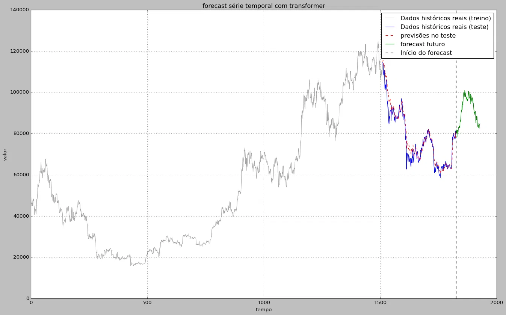

# 🪙 Previsão de Preços de Bitcoin com Transformer

[🇧🇷 Português](#-português) | [🇺🇸 English](#-english)

---

## 🇧🇷 Português

### Sobre o projeto

Modelo de deep learning baseado na arquitetura **Transformer** (a mesma família de modelo por trás de LLMs como o ChatGPT) aplicado à previsão de séries temporais — neste caso, o preço de fechamento diário do **Bitcoin (BTC-USD)**.

Este projeto nasceu de uma adaptação de um exercício de curso construído originalmente sobre uma série senoidal sintética. A proposta aqui foi ir além do exercício de sala de aula: substituir os dados sintéticos por um ativo financeiro real, volátil e não determinístico, e documentar honestamente o que muda quando o problema deixa de ser "fácil" para se tornar realista.

> **Origem acadêmica:** este notebook parte de um projeto do curso de pós-graduação em Ciência de Dados da Data Science Academy (DSA), adaptado e estendido de forma independente para este portfólio.

### Dataset

- **Fonte:** Yahoo Finance, via biblioteca [`yfinance`](https://pypi.org/project/yfinance/)
- **Ativo:** BTC-USD (preço de fechamento diário)
- **Período:** últimos 5 anos, granularidade diária
- **Divisão:** 80% treino / 20% teste, respeitando a ordem cronológica (sem embaralhar — vazamento de dados temporais invalidaria a avaliação)
- **Normalização:** `MinMaxScaler` ajustado **apenas** no conjunto de treino, para evitar vazamento de informação do teste

### Arquitetura do modelo

Um encoder Transformer aplicado a janelas deslizantes da série:

| Componente | Valor |
|---|---|
| Tamanho da janela de entrada (`input_window`) | 50 dias |
| Dimensão do embedding (`d_model`) | 32 |
| Cabeças de atenção (`nhead`) | 4 |
| Camadas de encoder (`num_layers`) | 4 |
| Dimensão do feedforward (`dim_feedforward`) | 128 (= 4 × `d_model`, proporção corrigida do padrão do PyTorch) |
| Dropout | 0.1 |
| Otimizador | Adam (`lr = 0.0005`) |
| Função de perda | MSE |
| Épocas | 60 |

**Pipeline:** janela de 50 valores → embedding linear → positional encoding (seno/cosseno) → 4 camadas de self-attention → agregação temporal → decoder linear → previsão do próximo valor.

### Metodologia e principais descobertas

Este projeto foi conduzido como uma sequência de hipóteses testadas e validadas empiricamente, não como uma configuração única aceita de primeira:

1. **Baseline honesto.** Antes de confiar em qualquer métrica isolada, o modelo foi comparado contra o "chute ingênuo" (`preço de amanhã = preço de hoje`) — o adversário mais difícil de vencer em séries de preços financeiros, que se comportam próximo de um *random walk*.
2. **Diagnóstico de lag.** Uma primeira configuração com janela grande (200 dias) produziu previsões sistematicamente atrasadas e suavizadas em relação ao preço real, um efeito de "média móvel embutida", causado pela agregação temporal simples sobre uma janela longa.
3. **Correção via tamanho de janela.** Reduzir a janela para 50 dias eliminou a maior parte do atraso, aproximando visivelmente a curva prevista da curva real.
4. **Limite do forecast autorregressivo.** Ao projetar o modelo vários passos à frente de forma recursiva (realimentando suas próprias previsões), a trajetória prevista degenera, após um certo horizonte, em um **ciclo periódico determinístico** — um comportamento característico de sistemas dinâmicos iterados sem fonte de ruído.
5. **Injeção de ruído calibrado.** Adicionar ruído gaussiano, calibrado pelo desvio-padrão real das variações diárias da série de treino, a cada passo do forecast recursivo devolve à trajetória prevista uma textura estatisticamente compatível com a volatilidade histórica do ativo.


*Dados de treino (cinza), teste real vs. previsto (azul/vermelho), e forecast futuro com ruído calibrado pela volatilidade histórica (verde).*
 
**Métricas finais** (configuração `input_window = 50`, `num_layers = 4`):
 
| Métrica | Valor |
|---|---|
| MSE | 4.654.418,00 |
| RMSE | 2.157,41 |
| MAE | 1.651,16 |
| MAE baseline (naive) | 1.270,42 |

### Limitações

- O forecast de longo prazo é uma extrapolação estatística do padrão aprendido, **não uma previsão validável de preço futuro real** — não existe dado real para comparar além do fim do conjunto de teste.
- O modelo usa apenas o preço de fechamento como variável (univariado); não incorpora volume, indicadores técnicos ou dados macroeconômicos.
- Ativos financeiros têm dinâmica próxima de um random walk; superar consistentemente um baseline naive é, por design, difícil.

### Como executar

```bash
pip install torch numpy pandas scikit-learn matplotlib yfinance tqdm
```

Abra `Previsao_de_criptomoedas.ipynb` no Jupyter ou Google Colab e execute as células em ordem (Runtime → Run all).

### Tecnologias

Python · PyTorch · NumPy · scikit-learn · yfinance · Matplotlib

---

## 🇺🇸 English

### About the project

A deep learning model based on the **Transformer** architecture (the same model family behind LLMs like ChatGPT) applied to time series forecasting — in this case, the daily closing price of **Bitcoin (BTC-USD)**.

This project started as an adaptation of a coursework exercise originally built on a synthetic sinusoidal series. The goal here was to go beyond the classroom exercise: replace the synthetic data with a real, volatile, non-deterministic financial asset, and honestly document what changes when the problem stops being "easy" and becomes realistic.

> **Academic origin:** this notebook originates from a project in the Data Science Academy (DSA) postgraduate Data Science program, independently adapted and extended for this portfolio.

### Dataset

- **Source:** Yahoo Finance, via the [`yfinance`](https://pypi.org/project/yfinance/) library
- **Asset:** BTC-USD (daily closing price)
- **Period:** last 5 years, daily granularity
- **Split:** 80% train / 20% test, respecting chronological order (never shuffled — temporal data leakage would invalidate evaluation)
- **Normalization:** `MinMaxScaler` fit **only** on the training set, to avoid leaking information from the test set

### Model architecture

A Transformer encoder applied to sliding windows of the series:

| Component | Value |
|---|---|
| Input window size (`input_window`) | 50 days |
| Embedding dimension (`d_model`) | 32 |
| Attention heads (`nhead`) | 4 |
| Encoder layers (`num_layers`) | 4 |
| Feedforward dimension (`dim_feedforward`) | 128 (= 4 × `d_model`, corrected from PyTorch's default ratio) |
| Dropout | 0.1 |
| Optimizer | Adam (`lr = 0.0005`) |
| Loss function | MSE |
| Epochs | 60 |

**Pipeline:** 50-value window → linear embedding → positional encoding (sine/cosine) → 4 self-attention layers → temporal pooling → linear decoder → next-value prediction.

### Methodology and key findings

This project was carried out as a sequence of hypotheses tested and empirically validated, rather than a single configuration accepted on the first try:

1. **Honest baseline.** Before trusting any single metric, the model was compared against the naive guess (`tomorrow's price = today's price`) — the toughest opponent to beat in financial price series, which behave close to a *random walk*.
2. **Lag diagnosis.** An initial configuration with a large window (200 days) produced predictions that were systematically lagged and smoothed relative to the real price — a "built-in moving average" effect caused by simple temporal pooling over a long window.
3. **Fix via window size.** Reducing the window to 50 days eliminated most of the lag, visibly bringing the predicted curve closer to the real one.
4. **Autoregressive forecast limit.** When projecting the model several steps ahead recursively (feeding its own predictions back in), the forecasted trajectory degenerates, past a certain horizon, into a **deterministic periodic cycle** — a behavior characteristic of iterated dynamical systems with no noise source.
5. **Calibrated noise injection.** Adding Gaussian noise, calibrated by the real standard deviation of daily changes in the training series, at each step of the recursive forecast restores a texture to the predicted trajectory that is statistically consistent with the asset's historical volatility.


*Training data (gray), real vs. predicted test values (blue/red), and future forecast with noise calibrated to historical volatility (green).*
 
**Final metrics** (`input_window = 50`, `num_layers = 4` configuration):
 
| Metric | Value |
|---|---|
| MSE | 4,654,418.00 |
| RMSE | 2,157.41 |
| MAE | 1,651.16 |
| MAE baseline (naive) | 1,270.42 |

### Limitations

- The long-horizon forecast is a statistical extrapolation of the learned pattern, **not a validated prediction of real future price** — there is no real data to compare against beyond the end of the test set.
- The model uses only closing price as a feature (univariate); it does not incorporate volume, technical indicators, or macroeconomic data.
- Financial assets behave close to a random walk; consistently beating a naive baseline is, by design, hard.

### How to run

```bash
pip install torch numpy pandas scikit-learn matplotlib yfinance tqdm
```

Open `Previsao_de_criptomoedas.ipynb` in Jupyter or Google Colab and run all cells in order (Runtime → Run all).

### Tech stack

Python · PyTorch · NumPy · scikit-learn · yfinance · Matplotlib

---

## ✍️ Autoria / Author

Victoria Fior — Data Science Graduate Student
